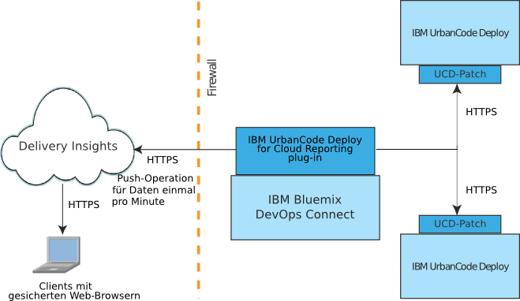

---

copyright:
  years: 2017
lastupdated: "2017-05-15"

---

{:new_window: target="_blank"}
{:shortdesc: .shortdesc}
{:screen: .screen}
{:pre: .pre}

# Informationen zu Delivery Insights
{: #about_delivery}

Mit Delivery Insights, einer Komponente von {{site.data.keyword.DRA_short}}, können Sie Bereitstellungsstatistiken, Metriken und weitere Informationen zu Ihrer IBM UrbanCode Deploy-Installation anzeigen. Beispielsweise können Diagramme über den Bereitstellungszeitraum, über erfolgreiche und fehlgeschlagene Bereitstellungen angezeigt werden, die alle nach logisch gruppierten Umgebungen sortiert sind.
{:shortdesc}

Für Delivery Insights ist eine DevOps Connect-Installation erforderlich. Informationen zum Einrichten der Installation finden Sie in [Daten von IBM UrbanCode Deploy-Servern anzeigen](uc_insights_connect_ucd.html).

Zu den in Delivery Insights angezeigten Informationen zählen unter anderem:

- Statistikdaten zur Bereitstellung, einschließlich Bereitstellungszeitraum und Bereitstellungsumfang im Zeitverlauf.
- Statistikdaten zur Fehlerrate bei der Bereitstellung nach Anwendung und Umgebung.
- Statistikdaten zur Komponentenbereitstellung, einschließlich Fehlerrate, Bereitstellungszeit und -zeitraum.

## Systeme - Überblick
{: #systems_overview}

Die Topologie für Delivery Insights umfasst mindestens eine lokale Installation von IBM UrbanCode Deploy <!-- (and optionally IBM UrbanCode Release) --> und das Dienstprogramm DevOps Connect.

Das folgende Diagramm zeigt eine typische Installation dieser Systeme.

- Eine Installation von **IBM UrbanCode Deploy** stellt die Informationen zu erfolgreichen und fehlgeschlagenen Bereitstellungen für die Metriken bereit. Für IBM UrbanCode Deploy ist für die Kommunikation mit IBM Bluemix DevOps Connect ein Patch erforderlich.

<!--
- **IBM UrbanCode Release** is an optional part of the topology. You can use the environment mappings in IBM UrbanCode Release to set logical environments for reports.

-->

- **IBM Bluemix DevOps Connect** (früher das Dienstprogramm IBM UrbanCode Sync) koordiniert die Kommunikation zwischen lokalen Installationen von IBM UrbanCode Deploy <!-- and IBM UrbanCode Release --> und von IBM gehosteten Services wie UrbanCode Insights. DevOps Connect verwendet die sichere HTTPS-Kommunikation mit den lokalen Servern und die Tokenauthentifizierung für die Bereitstellung von Daten für UrbanCode Insights.

  DevOps Connect benötigt Plug-ins, um eine Verbindung zu den anderen Systemen in der Topologie herzustellen.

- Als Komponente von {{site.data.keyword.DRA_short}} stellt **Delivery Insights** Metriken zur Bereitstellungsaktivität in IBM UrbanCode Deploy bereit, einschließlich Bereitstellungszeiten und Fehlerraten basierend auf verschiedenen Umgebungsgruppen. Die Autorisierung wird über {{site.data.keyword.Bluemix}}-Konten gesteuert.
