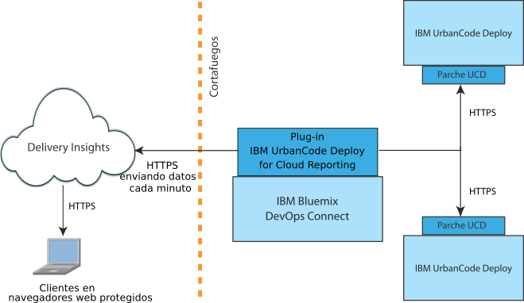

---

copyright:
  years: 2017
lastupdated: "2017-05-15"

---

{:new_window: target="_blank"}
{:shortdesc: .shortdesc}
{:screen: .screen}
{:pre: .pre}

# Acerca de Delivery Insights
{: #about_delivery}

Delivery Insights, una parte de {{site.data.keyword.DRA_short}}, muestra estadísticas de despliegue, métricas e información adicional sobre su instalación IBM UrbanCode Deploy. Por ejemplo, puede mostrar gráficas de duración, éxitos y errores de despliegue, clasificadas por entornos agrupados de forma lógica.
{:shortdesc}

Delivery Insights requiere una instalación de DevOps Connect. Para obtener información de instalación, consulte [Visualización de datos de servidores IBM UrbanCode Deploy](uc_insights_connect_ucd.html).

Entre la información que Delivery Insights proporciona, se incluyen:

- Estadísticas sobre despliegue, incluida la duración del despliegue y el volumen de despliegue a lo largo del tiempo.
- Estadísticas sobre la tasa de errores de despliegue por aplicación y entorno.
- Estadísticas sobre el despliegue de componentes, incluida la tase de errores, el tiempo de despliegue y la duración.

## Visión general de los sistemas
{: #systems_overview}

La topología de Delivery Insights incluye una o varias instalaciones locales de IBM UrbanCode Deploy <!-- (and optionally IBM UrbanCode Release) --> y el programa de utilidad DevOps Connect.

La siguiente gráfica muestra una instalación típica de estos sistemas.

- Una instalación de **IBM UrbanCode Deploy** proporciona la información sobre los despliegues satisfactorios y erróneos para las métricas. IBM UrbanCode Deploy precisa de un parche para comunicarse con IBM Bluemix DevOps Connect.

<!--
- **IBM UrbanCode Release** is an optional part of the topology. You can use the environment mappings in IBM UrbanCode Release to set logical environments for reports.

-->

- **IBM Bluemix DevOps Connect**, anteriormente conocido por IBM UrbanCode Sync Utility, coordina la comunicación entre las instalaciones locales de IBM UrbanCode Deploy <!-- and IBM UrbanCode Release --> y los servicios alojados por IBM como, por ejemplo, UrbanCode Insights. DevOps Connect utiliza una comunicación HTTPS segura en los servidores locales y señales de autenticación al proporcionar datos a UrbanCode Insights.

  DevOps Connect precisa de plugins para conectarse a otros sistemas en la topología.

- **Delivery Insights**, parte de {{site.data.keyword.DRA_short}}, proporciona métricas sobre la actividad de despliegue en IBM UrbanCode Deploy, incluidos tiempo de despliegue y tasas de errores de acuerdo a grupos de entornos. Las cuentas de {{site.data.keyword.Bluemix}} controlan las autorizaciones.
