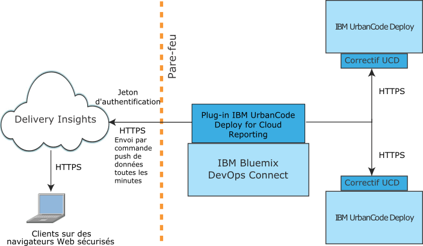

---

copyright:
  years: 2017
lastupdated: "2017-05-15"

---

{:new_window: target="_blank"}
{:shortdesc: .shortdesc}
{:screen: .screen}
{:pre: .pre}

# A propos de Delivery Insights
{: #about_delivery}

Delivery Insights, un composant de {{site.data.keyword.DRA_short}}, affiche des statistiques et des mesures liées au déploiement, ainsi que d'autres informations sur votre installation IBM UrbanCode Deploy. Il peut ainsi présenter des graphiques concernant la durée du déploiement, les réussites et les échecs, triés par environnements regroupés de manière logique.
{:shortdesc}

Delivery Insights requiert l'installation de DevOps Connect. Pour connaître les informations de configuration, voir [Affichage des données des serveurs IBM UrbanCode Deploy](uc_insights_connect_ucd.html).

Delivery Insights vous permet de visualiser notamment les informations suivantes :

- Statistiques sur le déploiement, dont la durée et le volume de déploiement dans le temps.
- Statistiques sur le taux d'échec de déploiement par application et par environnement.
- Statistiques sur le déploiement de composant, avec le taux d'échec, l'heure et la durée du déploiement.

## Présentation des systèmes
{: #systems_overview}

La topologie de Delivery Insights inclut une ou plusieurs installations sur site d'IBM UrbanCode Deploy <!-- (and optionally IBM UrbanCode Release) --> et l'utilitaire DevOps Connect.

Le diagramme suivant représente une installation typique de ces systèmes.

- Une installation d'**IBM UrbanCode Deploy** fournit des informations sur les déploiements ayant abouti et les déploiements ayant échoué destinées aux mesures. IBM UrbanCode Deploy requiert un correctif pour communiquer avec IBM Bluemix DevOps Connect.

<!--
- **IBM UrbanCode Release** is an optional part of the topology. You can use the environment mappings in IBM UrbanCode Release to set logical environments for reports.

-->

- **IBM Bluemix DevOps Connect**, anciennement IBM UrbanCode Sync Utility, coordonne la communication entre des installations sur site d'IBM UrbanCode Deploy <!-- and IBM UrbanCode Release --> et des services hébergés par IBM, tels que UrbanCode Insights. DevOps Connect utilise la communication HTTPS sécurisée vers les serveurs sur site et l'authentification par jeton pour fournir des données à UrbanCode Insights.

  DevOps Connect requiert des plug-in pour se connecter aux autres systèmes de la topologie.

- **Delivery Insights**, un composant de {{site.data.keyword.DRA_short}}, fournit des mesures sur l'activité de déploiement sur IBM UrbanCode Deploy, avec notamment les heures de déploiement et les taux d'échec par groupes d'environnements. L'autorisation est contrôlée par des comptes {{site.data.keyword.Bluemix}}.
