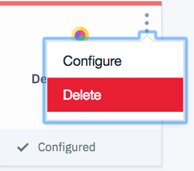

---

copyright:
  years: 2018
lastupdated: "2018-4-13"

---

{:shortdesc: .shortdesc}
{:new_window: target="_blank"}

# DevOps Insights의 개인 데이터 관리
{: insights_personal_data}

{{site.data.keyword.DRA_full}}에 수집되고 저장되는 개인 데이터를 삭제할 수 있습니다.
{: shortdesc}

{{site.data.keyword.DRA_short}}에 저장되는 데이터는 도구 체인 ID로 인덱싱됩니다. 도구 체인을 삭제하는 경우 해당 도구 체인의 일부로 수집된 저장소와 관련이 있는 모든 데이터가 삭제됩니다. 

## {{site.data.keyword.DRA_short}}에서 데이터 삭제 
{: #insights_delete_data}

다음 표는 {{site.data.keyword.DRA_short}}에서 데이터 삭제에 대한 시나리오를 나열하며 각 {{site.data.keyword.DRA_short}} 카테고리에 어떠한 영향을 미치는지에 대해 설명합니다. 

|  | Developer 및 Team Insights | 배치 위험성 | Security Insights |
|---------|-------------|-------------|-------------|
| [저장소 삭제 ](/docs/services/ContinuousDelivery/cd_personal_data.html#managing_grit_data){: new_window} |	저장소와 관련된 모든 데이터가 삭제됩니다. | 해당사항 없음 | 해당사항 없음 |
| [{{site.data.keyword.DRA_short}} 도구 통합 삭제 ](/docs/services/ContinuousDelivery/cd_personal_data.html#managing_toolchains){: new_window} |	저장소와 관련된 모든 데이터가 삭제됩니다. | 도구 통합이 일부인 도구 체인과 연관되는 모든 데이터가 삭제됩니다. | 도구 통합이 일부인 도구 체인과 연관되는 저장소와 관련된 모든 데이터가 삭제됩니다. |
| [도구 체인 삭제 ](/docs/services/ContinuousDelivery/cd_personal_data.html#managing_toolchains){: new_window} | 도구 체인과 연관되는 저장소와 관련된 모든 데이터가 삭제됩니다. | 도구 체인과 연관되는 모든 데이터가 삭제됩니다. | 도구 체인과 연관되는 모든 데이터가 삭제됩니다. |
| [파이프라인 삭제 ](/docs/services/ContinuousDelivery/cd_personal_data.html#managing_pipeline_data){: new_window} | 해당사항 없음 | 해당사항 없음 | 해당사항 없음 |
{:caption="표 1. 데이터 삭제 시나리오" caption-side="top"}

## {{site.data.keyword.DRA_short}} 도구 통합 삭제
{: #insights_delete_integration}

도구 체인에서 도구 통합을 삭제하는 경우 삭제를 실행 취소할 수 없습니다. 

1. DevOps 대시보드의 **도구 체인** 페이지에서 도구 체인을 클릭하여 해당 개요 페이지를 여십시오. 또는 앱의 개요 페이지에 있는 Continuous Delivery 카드에서 **도구 체인 보기**를 클릭한 후 **개요**를 클릭하십시오.
1. 삭제하려는 {{site.data.keyword.DRA_short}} 도구 통합에 대한 카드에서 메뉴를 클릭하여 구성 옵션에 액세스하십시오. 
1. 도구 체인에서 도구 통합을 삭제하려면 **삭제**를 클릭하십시오.

  

1. **삭제**를 클릭하여 확인하십시오. 
