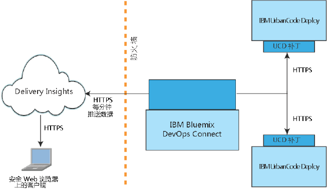

---

copyright:
  years: 2017
lastupdated: "2017-05-15"

---

{:new_window: target="_blank"}
{:shortdesc: .shortdesc}
{:screen: .screen}
{:pre: .pre}

# 关于 Delivery Insights
{: #about_delivery}

Delivery Insights 是 {{site.data.keyword.DRA_short}} 的一部分，可显示部署统计信息、度量值以及有关 IBM UrbanCode Deploy 安装的其他信息。例如，可以显示部署持续时间、成功次数和失败次数的图表，所有数据均按以逻辑方式分组的环境排序。
{:shortdesc}

Delivery Insights 需要安装 DevOps Connect。有关设置信息，请参阅[显示 IBM UrbanCode Deploy 服务器的数据](uc_insights_connect_ucd.html)。

可以在 Delivery Insights 中查看的一些信息包括：

- 有关部署的统计信息，包括部署持续时间和随时间变化的部署量。
- 有关部署失败率的统计信息（按应用程序和环境）。
- 有关组件部署的统计信息，包括失败率、部署时间和持续时间。

## 系统概述
{: #systems_overview}

Delivery Insights 的拓扑包括 IBM UrbanCode Deploy <!-- (and optionally IBM UrbanCode Release) -->和 DevOps Connect 实用程序的一个或多个内部部署安装。

下图显示了这些系统的典型安装。

- 通过安装 **IBM UrbanCode Deploy**，可提供有关度量值成功和失败部署的信息。IBM UrbanCode Deploy 需要补丁才可与 IBM Bluemix DevOps Connect 进行通信。

<!--
- **IBM UrbanCode Release** is an optional part of the topology. You can use the environment mappings in IBM UrbanCode Release to set logical environments for reports.

-->

- **IBM Bluemix DevOps Connect**（原名 IBM UrbanCode Sync Utility）用于协调 IBM UrbanCode Deploy <!-- and IBM UrbanCode Release -->内部部署安装与 IBM 托管的服务（如 UrbanCode Insights）之间的通信。DevOps Connect 与内部部署服务器之间使用安全 HTTPS 通信，并通过令牌认证向 UrbanCode Insights 提供数据。

  DevOps Connect 需要插件才可连接到拓扑中的其他系统。

- **Delivery Insights** 是 {{site.data.keyword.DRA_short}} 的一部分，根据环境组提供有关 IBM UrbanCode Deploy 上部署活动的度量值，包括部署时间和失败率。授权通过 {{site.data.keyword.Bluemix}} 帐户进行控制。
