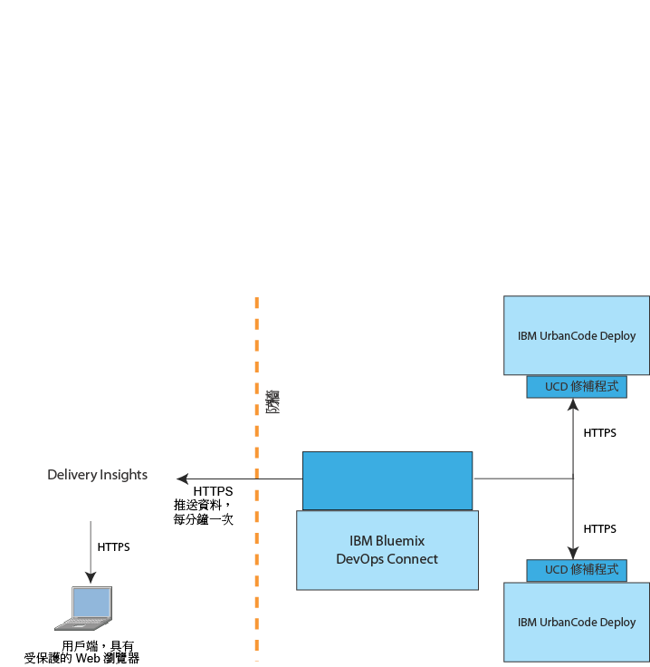

---

copyright:
  years: 2017
lastupdated: "2017-05-15"

---

{:new_window: target="_blank"}
{:shortdesc: .shortdesc}
{:screen: .screen}
{:pre: .pre}

# 關於 Delivery Insights
{: #about_delivery}

Delivery Insights 是 {{site.data.keyword.DRA_short}} 的一部分，它會顯示 IBM UrbanCode Deploy 安裝的部署統計資料、度量值及其他相關資訊。例如，它會顯示部署持續時間、成功及失敗等圖表，全部依邏輯分組環境排序。
{:shortdesc}

Delivery Insights 需要安裝 DevOps Connect。如需安裝資訊，請參閱[顯示來自 IBM UrbanCode Deploy 伺服器的資料](uc_insights_connect_ucd.html)。

您可以在 Delivery Insights 上看到的部分資訊包括：

- 部署的相關統計資料，包括部署持續時間，以及一段時間的部署量。
- 部署失敗率的相關統計資料（依應用程式及環境分類）。
- 元件部署的相關統計資料，包括失敗率、部署時間及持續時間。

## 系統概觀
{: #systems_overview}

Delivery Insights 的拓蹼包括 IBM UrbanCode Deploy <!-- (and optionally IBM UrbanCode Release) --> 的一個以上內部部署安裝，以及 DevOps Connect 公用程式。

下圖顯示這些系統的一般安裝。

- **IBM UrbanCode Deploy** 的安裝會提供部署成功和失敗的相關資訊給度量值。IBM UrbanCode Deploy 需要修補程式，才能與 IBM Bluemix DevOps Connect 通訊。

<!--
- **IBM UrbanCode Release** is an optional part of the topology. You can use the environment mappings in IBM UrbanCode Release to set logical environments for reports.

-->

- **IBM Bluemix DevOps Connect**（舊稱 IBM UrbanCode Sync Utility）會協調 IBM UrbanCode Deploy <!-- and IBM UrbanCode Release --> 內部部署安裝與 IBM 管理服務（例如 UrbanCode Insights）之間的通訊。DevOps Connect 使用與內部部署伺服器的安全 HTTPS 通訊以及記號鑑別，來提供資料給 UrbanCode Insights。

  DevOps Connect 需要外掛程式，才能連接至拓蹼中的其他系統。

- **Delivery Insights** 是 {{site.data.keyword.DRA_short}} 的一部分，它會提供 IBM UrbanCode Deploy 上部署活動的相關度量值，包括部署時間和根據環境群組的失敗率。授權是由 {{site.data.keyword.Bluemix}} 帳戶控制。
